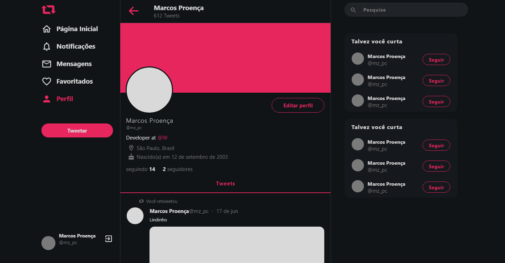

 Hello!

#

## **💻 if you are going to start the project, do the following:**

-  **install the project dependencies:**
    -  **_yarn_**
-  **start the server:**
    -  **_yarn_** start

### **🌌 tests**
   -  **_yarn_** test

### **🌌 preview**

-  **(1920 x 1348)**
   

### **🔧 technologies used**
-  ReactJS
-  axios
-  styled-components
-  eslint
-  prettier
-  git
-  yarn

## **front-end**

